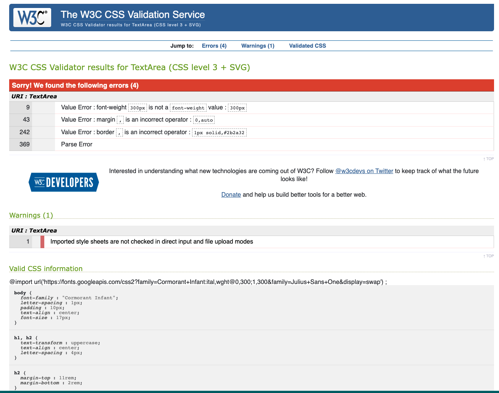
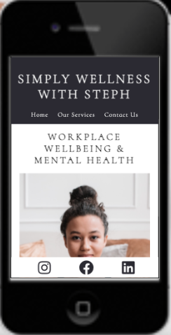
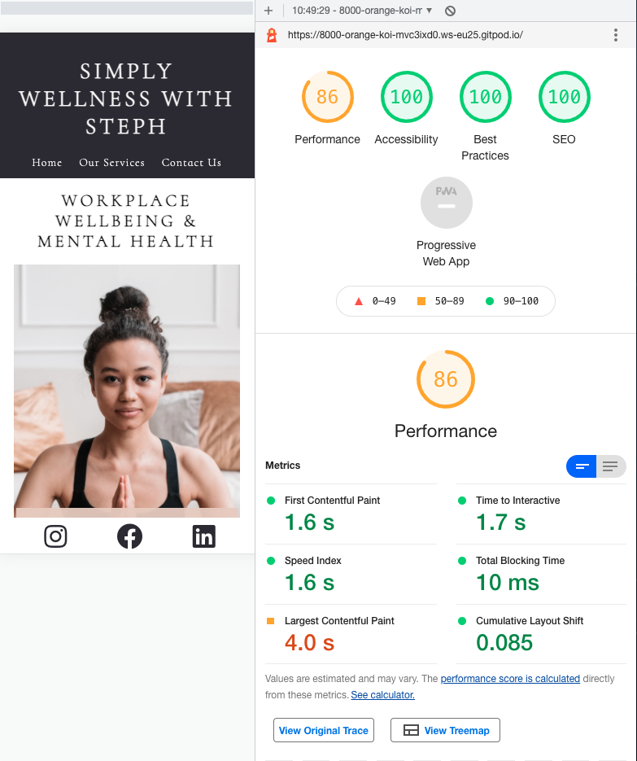
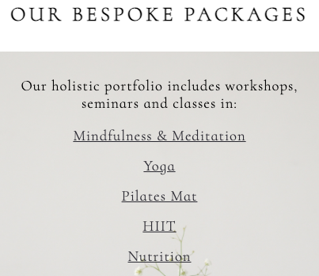

Simply Wellness: Workspace Wellness
==================================

* * *

ABOUT THE WEBSITE:
------------------

* * * 

[Link to deployed site](https://stephaniecrocker91.github.io/simplywellness/)

_Simply wellness_ is a website designed specifically to advertise _Workspace Wellness_. It advertises an array of services (classes and workshop packages) available for offices both virtual and in person. Services include: Mindfulness & Meditation, Yoga and Pilates. The website describes the benefits of focusing on workplace wellbeing and mental health in the workplace.

* * * 

## TARGET AUDIENCE:

* * *

It's target is to convince businesses to purchase these bespoke packages with the hopes of boosting employees productivity, morale, mental health and overall sense of wellbeing in the workplace.

*   Business owners.
*   Human resource managers.
*   Business employees.
*   Wellness enthusiasts.
*   Ages 18+ 

  

USER STORIES:
-------------

* * *

1.  Easy to navigate the site.
2.  Clear as to what services are provided and how.
3.  Insightful: why are these services benefitial to employees?
4.  Educational: I want to learn something about the services after reading the content of this site.
5.  I want the services to look appealing.

* * * 

STRAGETY:
---------

* * *

Create an aesthetically pleasing, peaceful and harmonious site that invites the user to a world of wellness. Consistent styling for easy navigation using a mobile-first approach and then ensuring it displays flawlessly across all devices. Create a code that is clear and allows to update with ease.

* * * 

STRUCTURE:
----------

* * *

### Header & Footer

* * *

#### _Navigation Bar & Logo_

*   The Logo & navigation bar is clearly displayed on each HTML page and contains links to:
    *   Home
    *   Our Services
    *   Contact Us
*   The logo contains a hyperlink to the index.html.
*   As you scroll down, the header: navigation bar & logo is fixed: _always_ at the top of the page for easy navigation through site.
*   The CSS styling makes it contrasting to the rest of the page, standing out.
*   Contains aria-labels attached to links to make it user friendly and accesible.

 * * *  

#### _Social Media Links_

*   The footer is also clearly displayed at the bottom of each HTML page and contains links to the business social media pages:

    *   Instagram
    *   Facebook
    *   Linkedin

*   It is fixed: always at the bottom of the page so as to be easily accesible to the user. It opens in a new tab with _blank.
*   The hyperlinks have font-awesome images clearly displaying each social media type.
*   The images are large enough to be instantly recognisable, and have been styled in CSS to match the colors of the web page.
*   Aria-labels on the social media links, to make it user friendly and accesible.

* * * 

### Home Page - _index.html_

* * *

The homepage consists of:

*   Image that clearly displays the theme of the website, and conveys a sense of peace, harmony and balance. The colors are cool and calming, and match the color palette of the site.
*   A header just below the navigation bar that clearly explains the purpose of the site: Workplace Wellbeing & Mental health. It's colors contrast the header.
*   A further sub-header within a pink box that goes into further detail: the aim of the services provided, and how they are delivered. It is easily readable: font is clear and the background-color is contrasting to the background image of the section.
*   Home page is minimalistic, clear and concise.
*   You can return to the homepage by clicking HOME or the LOGO on the Navigation bar.

* * * 
  
### Our Services Page - _ourservices.html_

* * *

Our services section is set up on another HTML page. It's aim is to describe in detail the services we provide. It is structured as follows:

*   A header: "Our Bespoke Packages", which clearly describes what we offer.
*   A sub-header: lists the specific services we offer: Meditation, Yoga, Pilates, Hiit and Nutrition. Each service listed hyperlinks to the section of the page with a more detailed description of that particular service.
*   A small paragraph: in a white box detailing how the service packages.
*   This first section has an image-background that is easy on the eye, subtle and allows the text over it to be easily read.

Each one of the hyperlinks at the top of this page take the user to a sub-section containing:

*   A header: with the service name (E.g: MINDFULNESS & MEDITATION). The background color is dusty pink, and the font is uppercase. It makes for a clear distinction between the different services sections.
*   An image: that portrays the service to the user.
*   A few paragraphs: about the service and it's benefits. On small screens (mobile and some tablets) the paragraph is directly below the image. On larger displays, the paragraphs are to the right of the image.
*   A "Back to Top" link: This hyperlink which takes the user back to the top of the page. It is italicized and underlined so as to stand out.

* * *   

### Contact Us Page - contactform.html

* * *

The contact form section is also set up on another HTML page. The aim of this contact form, is for the user to contact us regarding interest. It consists of:

*   A header: "Contact Us", which clearly describes the purpose of this section.
*   A background image: that is aesthetically pleasing and makes the form stand out.
* A header for the form: Enquire further:
*   The form:Containing
    *   Required text input field boxes and labels (Name, Surname, Email and Contact number).
    *   Paragraph explaining the next checkbox section is optional.
    *   Optional checkboxes for interested services (Meditation, Yoga, Pilates, Hiit, Nutrition).
    *   A Send! button which submits the form.
    *   Please note: all input fields (except for the checkbox) are required to be filled out to be able to submit the form.
*   The contact form is simple, easy to read, and enphasizes the services available to the user.

  
* * * 

## SKELETON:

-----------

### WIREFRAMES:
* I began deisgning from a mobile display. I wanted my nav and footer to always be displayed. I wanted a homepage image to load up immediately. I wanted the form section to have a background image.

* For the wide screen display, I had a rough idea of how I wnated the Homepage and services section displayed. I wanted the image in the home page to be large and inviting, with introduction to the site below. I wanted the services section to be layed out with HEADER, Image to the left and paragraph to the right.

* * * 

## SURFACE:

* * *

Before starting, I created a very basic collage with the images, fonts and palettes that initially inspired me. 

### Colors

* * *

This was the image that inspired the colors for my webisite. I wanted to work with warm, earthy tones that contribute to the sites purpose. I added a few greens in the images, to give it more vibrancy.

I then picked the following colors to be used in defferent elements on the site: font color and background-color.

* * * 

### Typography

* * *

*   I initially wanted to combine [Cormorant Infant](https://fonts.google.com/specimen/Cormorant+Infant) for main text and [Julius Sans One](https://fonts.google.com/specimen/Julius+Sans+One) for headers, but after testing I preferred keeping it all [Cormorant Infant](https://fonts.google.com/specimen/Cormorant+Infant)
*   Cormorant Infant: minimalistic style which portrays harmony, lightness, space and balance.
*   Letter-spacing: To create more sense of space I added 1px letter spacing as default body styling, and and 4px for the headers.
*   Font-style: I played around with Uppercase styling (for headers) and Italics (for some paragraphs) to add a sense of dinamics to the site.

### Images and Icons

* * *

*   I chose an initial image as inspiration (Hero image displayed under Colors section), and from there chose other similar images. All these images have the same earthy tones, with a few pops of green. They are minimalistic, and convey the purpose of the website. It was important to use images for every service description section, so as to give visual aid of the service provided. These images were sourced by [Pexels.](https://www.pexels.com/)
*   I used instantly recognisable [Font Awesome](https://fontawesome.com/) icons for the social media links in the footer. These immediately stand out to the user. I styled them with the colors of the website and fixed them to the bottom of the screen.

* * * 

FEATURES:
---------

* * *

### Current features

*   Navigation bar directing to pages.
*   Pages: Homepage

    *   Homepage: Introduction to website
    *   Our services Page: Hyperlinks to different services on the page, "Back to top" hyperlink under every service section.
    *   Contact Us Page: Containing a contact us form when the user must provide contact details, and can _optionally_ tick the services of interest.

*   Social Media links: Facebook, Instagram, Linekdin

* * * 

### Future features

*   A Page containing a complimentary pre-recorded taster sessions: Yoga, Pilates, Meditation, Hiit, and a recipe.

* * * 

## LANGUAGES:

* * *

*   HTML5
*   CSS

* * * 

## OTHER TECHNOLOGIES, FRAMEWORKS & LIBRARIES:

* * *

*   [Google Fonts](https://fonts.google.com/)
*   [Font Awesome](https://fontawesome.com/)
*   [GitHub](https://github.com/)
*   [GitPod](https://www.gitpod.io/)
*   [Coolors](https://coolors.co/)
*   [Pexels](https://www.pexels.com/)
*   [Stack Overflow](https://stackoverflow.com/)
*   [Code beautify](https://codebeautify.org/html-to-markdown)
*   [Compress Jpeg](https://compressjpeg.com/)

* * * 

## TESTING, BUGS & FIXES:

* * *

For testing I used the following sources:

* * * 

### Tests

* * *

#### [HTML Validator](https://validator.w3.org/)

* * * 

##### Home Page - index.html

*   Homepage came up with no errors.

##### Our Services - ourservices.html

* * * 

1.  For this error, I removed the div, and created an unordered list containing the services names and the hyperlinks in them. I then styled with CSS. List-style none, text-align center, and margin top 1rem. I re-tested and there was still an error: the h3 wrapped around the ul. Remved this and then had to restyle CSS again.
2.  Same as above.
3.  Debugged by solving first bug.
4.  Removed illegal character path (space) in file name. Not it is man-meditating-yellowhair.jpg
5.  Deleted stray div.
6.  Deleted stray div.
7.  Removed illegal character path (space) in file name. Now it is assets/images/pilates-lady.jpg

1.  Added a h3 to the form section for semangtic clarity.

And finally...

##### Contact Us - contactform.html

*   Contact us page came up with no errors.

#### [CSS Validator- Jigsaw](https://jigsaw.w3.org/css-validator/)

1.  Wrong syntax: Removed the px from 300px.
2.  Wrong syntax: Removed the unnecesary coma.
3.  Wrong syntax: Removed the unnecesary coma.
4.  Typo: Accidental extra { removed.

And finally...

* * * 

#### Manual testing 

* * * 

* Social media links in footer linking to external sites work, and open the site in a new tab.
* Links to other pages in navigation bar work in all pages, and link to the correct page.
* Links to different sections of a page work correctly, and jump to the correct section of the page allowing everything to be fully visible to the user.
* All images and icons load properly and are fully visible to the user.
* Nav bar and footer is fixed, always displayed on the screen and fully visible.
* The Contact Form required text input (name, surname, email, number) and of the correct input to be submitted.
* The checkboxes in the form is optional as intended. Form can be submitted without them, as long as text input fields are filled out.
* The site has responsive deisgn, allowing the webste and it's features to be fully displayed (visible) on all display sized: phone, tablets, laptops, larger screens.

Responsive design:
##### Phone Display
* I took a mobile first design approach, so the website runs very smoothly from a mobile screen. 
* The navigation bar and footer is always dislplayed, large enough to click yet not distracting from its content. 
* The initial homescreen is welcoming, displaying the image upon loading on, and can be easily scrolled down to view further site information.
* The contact form is of an appropriate size, and easily clockable to input the field text/ tick checkboxes.
###### BUGS & FIXES: 
* Initially the send button was too close to the social media links, but upon adding margin-bottom: 4rem to the form section, the problem was fixed.
* Even though the first image presented nicely on MY mobile screen, when I checked the amiresponsive site the nav bar was too big and the image was chopped. I improved this by making font smaller for maxwidth=320px mobile screens (font=14px), and decreased the margin-top and margin-bottom for the h2 headers. I wanted the Image to be more visible. It improved it, but if I would like to fix this in the future.

* * * 

##### Tablet Display
* The tablet displays nicely on all pages. 
* The homepage image and most of the introductory text is displayed instantly. 
* Nav bar is of a good size, links to all pages are eaisly clickable.
* Our services section: Images are still displaying on top and text below.

* * * 

##### Laptop Display
* The laptop also displays nicely on all pages. 
* Nav bar is of a an appopriate size.
* The homepage image and most of the introductory text is displayed instantly.
* Our services section: Images are now to the left of the text. It is more visually pleasing for this display width.

* * * 

##### Larger Screens Display
* The large screens also displays nicely on all pages. 
* Nav bar is of a an appopriate size.
* The homepage image and all of the introductory text is displayed instantly.
* Our services section: Images are still to the left of the text.

* * * 

##### My large sccreen DISPLAY (19020 X 1200px):
The Homepage image is cropped, and begins from her nose down (which was not initially intentional). I actually quite like it like this, so decided to keep it. I like the way it focuses on her smale, and her hands.

* * * 

#### Lighthouse testing
* Initially, with the lighhouse testing the performance read 57%. I asked the tutors at code Instutute, and they mentioned that reducing my Hero Image would help. 
* The Best Practices was 93%, and lighthouse suggested I add rel=noopener to my social media links.

* Now:
    * Mobile: 86% Performance, 100% Best Practices
    

    * Display: 99% for Performance, 100% Best Practices

* * * 

#### Testing User Stories

* * * 

1.  Easy to navigate the site.
    *   Nav bar is always at the top of the menu, and easily directs you to different pages.
    
    
    
   
    * Back to top buttons: underneath each long text section to take you back to top.

    
    
    
    * Logo will take you back to home page.

    
    
    
    * Social media links fixed at the bottom of the site, to easily navigate to other pages. they open in a new tab.
    
    
    
2.  Clear as to what services are provided and how.
    
    
    *   Our services section has an initial breakdown describing each service provided. It is clear and concise.

    
    
    
    * Following, there is a description of the type of packages available.

    
    
    
    * Further down, each service is described by: header, an image portraying the service and a few paragraphs describing the service and its benefits.

    

3.  Insightful: why are these services benefitial to my employees?
    *   Home page subheader describes immediate the benefits of these wellness services: Boost productivity & wellbeing.

    

    * Each service description section describes the benefits of these services to both employer and employee.

    

4.  Educational: I want to learn something about the services after reading the content of this site.
    *   The Our Services section goes into details about each services: content, health and psychological benefits and structure.

    

5.  I want the services to look appealing.
    *   Images throughout the website portray the services as inviting, inclusive and appealing.

    
    
    

    * Use of language is inviting

## DEPLOYMENT:

### GitHub Page

This site was deployed to Github pages using the following steps:

1. Go to the Github repository
2. Clock on the Settings tab
3. Go to Github Pages Section
4. From thr source dropdown meny select Main branch
5. Once this has been selected, provide the link to the completed website

[Link to deployed site](https://stephaniecrocker91.github.io/simplywellness/)

* * *

### Forking The GitHub Repository

* * *
You can Fork the Repository. This makes a copy of the original repository on our Github account so you can make changes without affecting the original repository.
1. Log into GitHub and locate the GitHub repository you want.
2. Click on the "Fork" button which is located in the top right corner.
3. You will now have a copy of the original repository in your GitHub account.

* * * 

### Cloning the Project.
* * *
1. Log into GitHub and locate the GitHub repository you want.
2. Under the repository name, click "Code" button which will come up with a dropdown menu.
3. Where it says Clone, copy the link below.

* * * 

CREDITS:
--------

* * *

### Content
* A lot of the content/website language came from a previous website I had [Simply Wellness with Steph](https://www.simplywellnesswithsteph.com/), created by Wix.
* Services educational content:
    * [NHS Website: benefits of yoga](https://www.nhs.uk/live-well/exercise/guide-to-yoga/)
    * [HIIT webiste: for benefits of HIIT](https://www.healthline.com/nutrition/benefits-of-hiit#TOC\_TITLE\_HDR\_6)
    * [Betterhealth Website: benefits of pilates](https://www.betterhealth.vic.gov.au/health/conditionsandtreatments/pilates-and-yoga-health-benefits)
    * [Stretch in the city website: Benefits of nutrition](https://stretchingthecity.com/corporate-wellbeing/nutrition/) 
    * [Medical News Website: Benefits of healthy nutrition](https://www.medicalnewstoday.com/articles/322268)
*  I used part of the Love Running Project Code as a template for the Navigation bar: structured in unordered lists and having the logo also be an anchor element.  

 

* I also used the fixed CSS styling element for the nav bar and social media links (as done in the love running).
* Was inspired by the Love Running project idea of using a background image and a background color for the form.

* Images & Icons:
    * [Font Awesome](https://fontawesome.com/) for social media anchor links.
        *   [Instagram icon](https://fontawesome.com/v5.15/icons/instagram?style=brands)
        *   [Likedin Icon](https://fontawesome.com/v5.15/icons?d=gallery&p=2&q=linkedin)
        *   [Facebook icon](https://fontawesome.com/v5.15/icons/facebook?style=brands)
    * [Pexels](https://www.pexels.com/)
        *   [Hero Image](https://www.pexels.com/photo/green-vegetable-on-white-ceramic-plate-4117644/)
        *   [Our Services background Image](https://www.pexels.com/photo/nature-summer-texture-garden-7815537/)
        *   [Our Services: Meditation Man Image](https://www.pexels.com/photo/man-in-white-pants-sitting-on-white-yoga-mat-7113607/)
        *   [Our Services: Yoga Man Image](https://www.pexels.com/photo/fashion-man-people-art-4662438/)
        *   [Our services: Pilates Woman Image](https://www.pexels.com/photo/young-obese-female-doing-bending-exercise-in-white-studio-6975385/)
        *   [Our Services: HIIT Jumping rope Image](https://www.pexels.com/photo/woman-using-a-jump-rope-8032787/)
        *   [Our Services: Nutrition Image](https://www.pexels.com/photo/green-vegetable-on-white-ceramic-plate-4117644/)
        *   [Form Section Background Image](https://www.pexels.com/photo/person-touching-white-flowers-4883429/)

